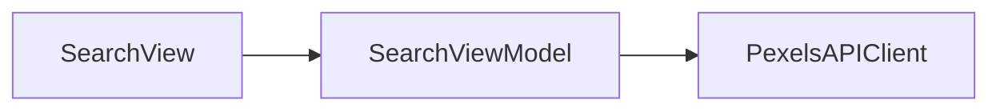

## 概要
写真検索と閲覧ができるiOSアプリ

## アーキテクチャ
MVVMをベースにしています。



## Dependency Injection（`DependencyValues`）
`@TaskLocal`ベースのDIコンテナを使用。`liveValue`を基準にスコープごとに上書きが可能です。
ViewModelでは`@Dependency(\.xxx)`で明示注入してください。

```swift
// `liveValue`注入部分
private enum PexelsAPIProvidingKey: DependencyKey {
    
    static let liveValue: PexelsAPIProviding = PexelsAPIClient(
        apiRequestProvider: APIRequestClient.create(apiKey: pexelsKey, baseURL: baseURL)
    )
}

extension DependencyValues {
    var pexelsAPIProvider: PexelsAPIProviding {
        get { self[PexelsAPIProvidingKey.self] }
        set { self[PexelsAPIProvidingKey.self] = newValue }
    }
}

// 使用側（ViewModel）
@MainActor
@Observable
final class SearchViewModel {
    @ObservationIgnored
    @Dependency(\.pexelsAPIProvider) private var pexelsAPIProvider
    // ...
}
```
テストでは次のように依存性を差し替えて利用します。
```swift
// テスト中にモック実装を注入
let viewModel = DependencyValues.withDependency {
    $0.pexelsAPIProvider = MockPexelsAPIClient(response: dummyResponse)
} operation: {
    SearchViewModel()
}
```

## 画面遷移（`NavigationValues` + `Router`）
`@TaskLocal`にRouterを載せる方式。`NavigationRoot(\.search)` でサブツリーごとに独立したスタックを注入できます。
ViewModelでは`@Navigation(\.xxx)`で明示注入してください。

```swift
// View側
NavigationRoot(\.search) {
    searchContent(viewModel.state)
        .navigationDestination(for: SearchRoute.self) { route in
            switch route {
            case .photoDetail(let photo): PhotoDetailView(photo: photo)
            }
        }
}

// 使用側（ViewModel）
@Navigation(\.search) private var router

func tappedThumbnail(photo: Photo) {
    router.push(.photoDetail(photo))
}
```

## テスト
日本語のGiven/When/Thenで定量的な検証を記述してください。

```swift
@Test
func searchPhotosが_空文字列のクエリを渡した時_invalidURLエラーがスローされる() async {
    let mock = MockAPIRequestProvider()
    let client = PexelsAPIClient(apiRequestProvider: mock)
    await #expect(throws: APIError.invalidURL) {
        try await client.searchPhotos(query: "", page: 1, perPage: 10)
    }
}
```

## APIキー設定
Info.plistファイルに以下のように`PEXELS_API_KEY`を設定しています。
ビルド環境（.xcconfig/CI）から注入してください。

```xml
<!-- SnapSearch/Info.plist -->
<key>PexelsAPIKey</key>
<string>$(PEXELS_API_KEY)</string>
```

## ブランチ命名規則
ブランチ名の先頭には変更内容を示すプレフィックスを付けます。
- `impl_XXX`：新しい機能の実装
- `add_XXX`：小規模な追加や補助的な要素
- `fix_XXX`：バグや不具合の修正
- `update_XXX`：既存機能や設定の更新、ライブラリのアップデート

### 使用例
- 写真検索機能の実装 → `impl_photo_search`
- ログイン画面にボタンを追加 → `add_login_button`
- ページネーションの不具合修正 → `fix_search_pagination`
- CI設定の更新 → `update_ci_config`

### 運用ルール
すべての変更は `main` ブランチへ直接 push せず、必ずPullRequestを通してマージします。
